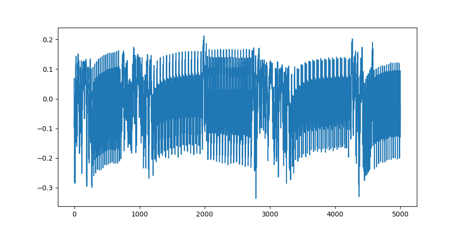

# ChipWhisperer Lightweight Cryptography Wrapper



A wrapper around algorithms from the [_NIST_ Lightweight
Cryptography Standardization
Project](https://csrc.nist.gov/projects/lightweight-cryptography). Any algorithm
listed there for submission should just (almost) be plug-and-play.

## Usage

> **Prerequisites:** usage of this repository requires a successful installation
> of the [ChipWhisperer Python
> Library](https://chipwhisperer.readthedocs.io/en/latest/installing.html#install-repo-git).

To start power tracing a software implementation of an LWC algorithm, there are
few steps to complete.  

0. (Forking and) cloning this repository
1. Adding the implementation to your targets
2. Configuring the build process
3. Creating your trace capturing script

### 0. (Forking and) cloning this repository

Before we can start working with compiling NIST algorithms for your
ChipWhisperer targets, you need the code of this repository. I suggest forking
it, and then cloning it to your own pc. Remember that this repository uses
submodules. Therefore, you need to run the following command to pull in the
submodule.

```bash
git submodule update --init
```

### 1. Adding the implementation to your targets

If you have found an implementation you are happy with, you need to add it into
the *targets* folder of your cloned version of this repository. On Unix systems
(Mac and Linux), I suggest just creating a symlink to the implementation you
would like to use.

The implementation here is the folder containing the *api.h* and your other *C*
and header files.

### 2. Configuring the build process

The only configuration which needs to be done in order to compile a target
algorithm is in the *makefile*. You have to select which target you want to
compile (setting `TARGET_DIR` to the name of the folder in your *targets*),
enable which components you want to include (`DO_ENCRYPT`, `DO_DECRYPT` and/or
`DO_HASH`), and optionally select which C files you want to add to your
compilation (`SRC += `).

Then we can run the following command to build our target code. Replace `[YOUR
PLATFORM]` with a target of your choice. A list of possible targets can be seen
[here](https://raw.githubusercontent.com/coastalwhite/simpleserial-c-template/main/PLATFORMS.md).

```bash
PLATFORM=[YOUR PLATFORM] make
```

This will output all files to the `outputs/[NAME OF YOUR TARGET_DIR]` folder.

### 3. Creating your trace capturing script

Below is an example of a trace capturing script. This uses functions from the
*cwlwc.py* file in the root of this directory.

Remember to change `KEY_BYTES` and `NONCE_BYTES` to the specific amounts for
your target.

> **Note:** This example is for an *STM32F* target.

```python
import cwlwc as LWC
import matplotlib.pyplot as plt

from chipwhisperer.capture.api.programmers import STM32FProgrammer

l = LWC.LWC_CW("[PATH TO HEX FILE]", STM32FProgrammer,
        KEY_BYTES=16, NONCE_BYTES=12)

key = [
    0x00,0x01,0x02,0x03,
    0x04,0x05,0x06,0x07,
    0x08,0x09,0x0A,0x0B,
    0x0C,0x0D,0x0E,0x0F
]
plain_text = [0x00, 0x01]
nonce = key
ad = key

cipher_text, trace = l.encrypt(
    bytearray(plain_text),
    bytearray(key),
    associated_data=bytearray(ad),
    nonce=nonce
)

print(cipher_text)

plt.plot(trace)
plt.show()
```

## License

Licensed under a MIT license.
